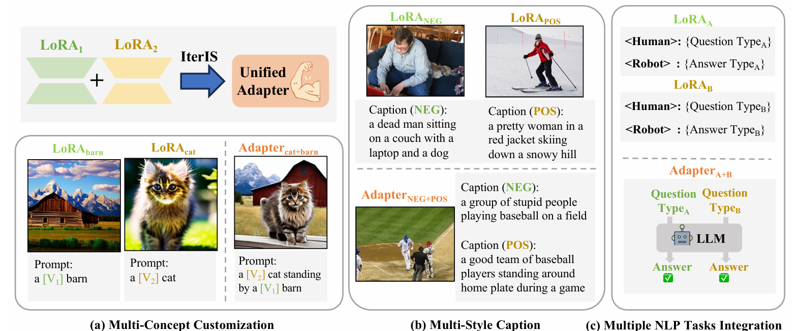

# IterIS: Iterative Inference-Solving Alignment for LoRA Merging ([CVPR 2025](https://cvpr.thecvf.com/))

- Code Contributor: [Hongxu Chen](https://ustcchx.github.io/hongxuchen.github.io/), [Bowei Zhu](https://www.linkedin.com/in/%E6%9F%8F%E8%8B%87-%E6%9C%B1-60b620335/), [Zhen Wang](https://github.com/baaaad), [Runshi Li](https://orcid.org/0009-0008-6586-4914), and [Long Chen](https://zjuchenlong.github.io/)
- Paper: [arXiv](https://arxiv.org/pdf/2411.15231)




## Introduction
This is the official implementation of IterIS, accepted at CVPR 2025. The code requires GPU acceleration and can run on a single RTX 3090. Additionally, we recommend using the default hyperparameter settings for optimal performance. 

## To-do List
- [X] Release code for merging in LLM merging experimetns 
- [X] Release code for merging in V&L experimetns
- [ ] Release code for merging in diffusion experimetns  

## Project Directory Structure
The complete file tree should be as follows:

```
├── config
│   ├── EMOTION-t5-lora-train-config
│   ├── GLUE-t5-lora-train-config
│   └── methods-config
├── data
│   ├── Emotion_v2.5
│   │   ├── emoint
│   │   ├── emotion-cause
│   │   ├── isear
│   │   └── tec
│   └── SENTICAP
│       ├── negative
│       ├── positive
│       └── val2014
├── images
├── loras
│   ├── EMOTION-lora-t5
│   │   ├── emoint
│   │   ├── emotion-cause
│   │   ├── isear
│   │   └── tec
│   ├── GLUE-lora-t5
│   │   ├── cola
│   │   ├── mnli
│   │   ├── mrpc
│   │   ├── qnli
│   │   ├── qqp
│   │   ├── rte
│   │   ├── sst2
│   ├── SENTICAP-lora-blip
│   │   ├── negative
│   │   ├── positive
│   ├── __pycache__
│   └── train_src
└── train
```

## Setup
### 1. Install Dependencies
Run the following command to install all required packages:  
```bash
python -m pip install -r requirements.txt -f https://download.pytorch.org/whl/cu121/torch_stable.html
```

### 2. Download the Dataset
Download and extract the images into `./data/SENTICAP/val2014`:  
```bash
wget http://images.cocodataset.org/zips/val2014.zip
unzip val2014.zip -d ./data/SENTICAP/val2014
```

---

## Training, Merging, and Evaluation
### 3. Train Multiple LoRAs  
(Taking the V&L experiments as an example)
```bash
python train/train_blip_negative.py  # Train NEG LoRA
python train/train_blip_positive.py  # Train POS LoRA
```
- You can modify the training settings in the source code or the YAML files located in `./config/`.
- The trained LoRA checkpoints are available for download [here](https://huggingface.co/Daxuxu36).

After downloading, place them in the corresponding subfolder within `./LoRAs/`.

---

### 4. Merge Different LoRAs  
Use the following command to merge LoRAs based on the specific task:  
```bash
python IterIS.py --task_type <TASK_NAME>
```
Supported task types:  
- `TASKS_blip_base` → Merges POS and NEG LoRAs for V&L part
- `GLUE_t5` → Merges GLUE LoRAs for LLM part (Multi-task)
- `EMOTION_t5_large` → Merges emotion classification LoRAs for LLM part (In-domain)

You can customize the merging settings in `./config/methods-config/iteris-config.yaml`. Additional command-line parameters are available to control whether to save the merged model. 

YAML Key Parameters and Usage:  
- `--max_iter`: Maximum number of iterations for IterIS.  
- `--task_targets`: A list of tasks to be merged.  
- `--with_pretrain_matrix`: Whether to include the pre-trained weights in IterIS.  
- `--max_length`: Maximum token length for padding or truncation.  
- `--lora_alpha`: Alpha value for the target task's LoRA adaptation.  
- `--manual_coef`: Manually adjusted weighting coefficient.  
- `--alpha_1`: Regularization coefficient for one type of inner-product matrix in the closed-form solution.  
- `--alpha_2`: Regularization coefficient for another type of inner-product matrix in the closed-form solution.  
- `--rank`: Rank of the LoRA adaptation.  
- `--save`: Whether to save the merged model.

<!-- Our merged model checkpoints are available [here](). -->

### 5. Evaluate the Merged Model  
After merging, the evaluation will run automatically using `eval_model.py`.  

---

### Additional Notes
- If you encounter any issues, please refer to the [GitHub Issues]() section or contact the authors.
- For further customization, modify configurations in `./config/` and `./config/methods-config/`.

---

This repository provides the official implementation of IterIS, and we welcome contributions and discussions! 🚀

# Reference
Please cite our paper if you use our method in your works:

```bibtex
@article{chen2024iteris,
  title={IterIS: Iterative Inference-Solving Alignment for LoRA Merging},
  author={Chen, Hongxu and Li, Runshi and Zhu, Bowei and Wang, Zhen and Chen, Long},
  journal={arXiv preprint arXiv:2411.15231},
  year={2024}
}
